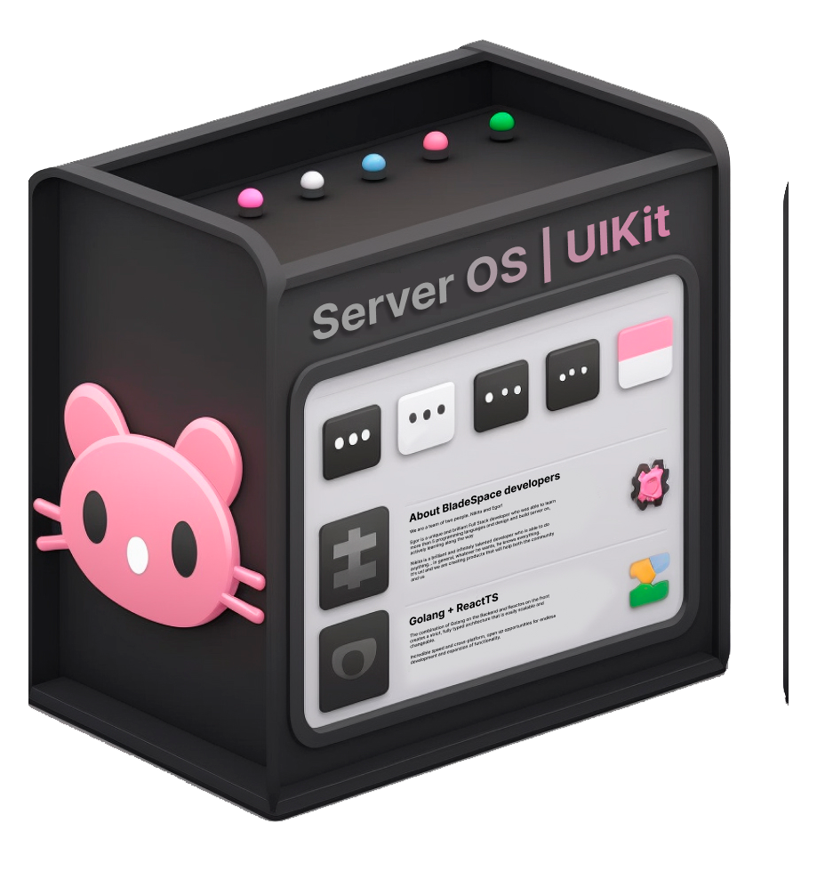

<!-- markdownlint-disable-next-line -->
<p align="center">
  <a 
    href="https://github.com/Blade-Space" 
    rel="noopener" 
    target="_blank">
        
    </a>
</p>

<h1 align="center">Server OS UIKit 🐇💾🔥 <i>beta</i></h1>

## What is **Server OS UIKit**

The library of UI elements for server os. 
designed to standardize system interfaces and enable third-party developers to create their own applications and add a single (with the main system) interface to them

* support TypeScript
* build using Vite

You can see the list of all available components: [StoryBook](https://blade-space.github.io/UIKit/)

## Instalation 

### Server OS UIKit

**Server OS UIKit** is available as an [npm package](https://www.npmjs.com/package/server-os-uikit).

npm:

```bash
npm install server-os-uikit
```
yarn:

```bash
yarn add server-os-uikit
```

### Styles

you need to connect styles to your application.

```ts
import 'server-os-uikit/dist/style.css';
```
The entry point of your application: `main.js` | `main.ts` | `index.js` | `index.ts`
```ts
import React from 'react'
import ReactDOM from 'react-dom/client'
import App from './App'
import './index.css'
// ! This line ⬇️⬇️⬇️
import 'server-os-uikit/dist/style.css';

ReactDOM.createRoot(document.getElementById('root') as HTMLElement).render(
  <React.StrictMode>
    <App />
  </React.StrictMode>,
)
```

**and start using Server OS UIKit! 🤍🐇**

## Getting started with Server OS UIKit
***
Here is an example of a basic app using UIKit `Text` component:
```ts
import './App.css'

import {Text} from 'server-os-uikit';

function App() {
  return <Text bold color={"blue"}>Hello World 🤍</Text>
}

export default App
```
In the interactive showcase below, try changing the code and see how it affects the output. (Hint: change `color` to "blue" | "white" | "gray" | "dark gray" and `size` to "large 24px". For more options, see the Text component page in our [StoryBook](https://blade-space.github.io/UIKit/).)

**[StoryBook](https://blade-space.github.io/UIKit/)**


## Documentation:
*soon ...*

